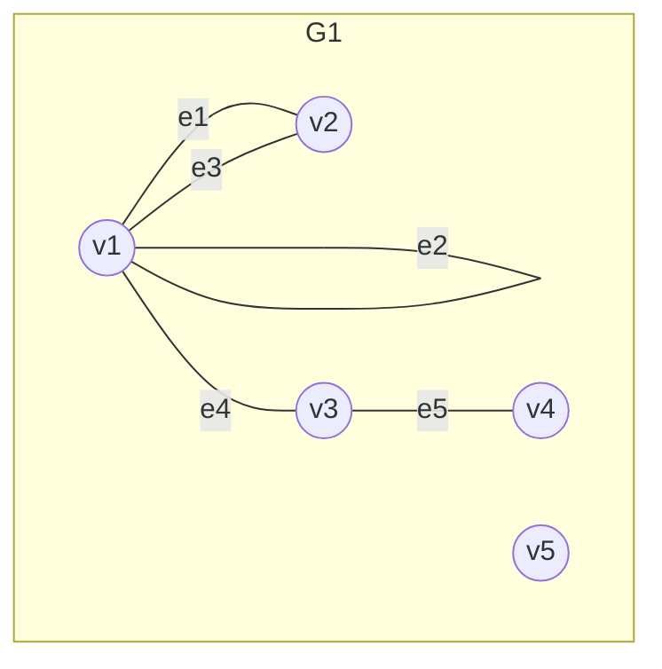
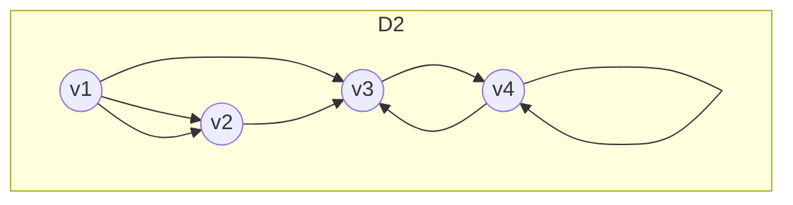
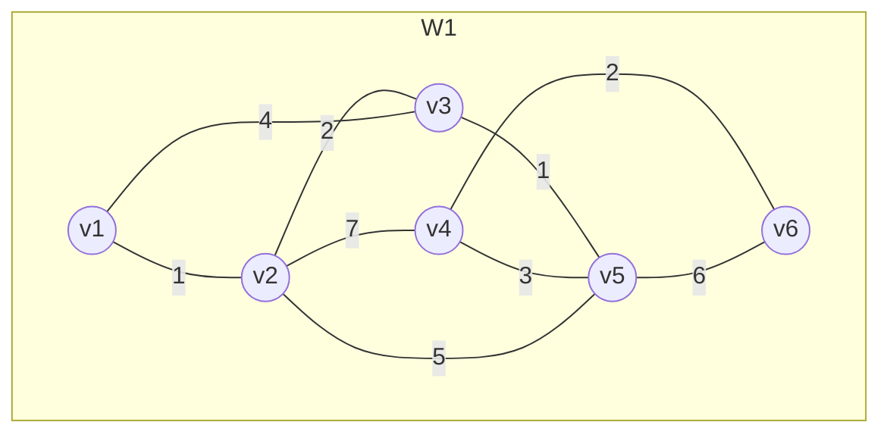
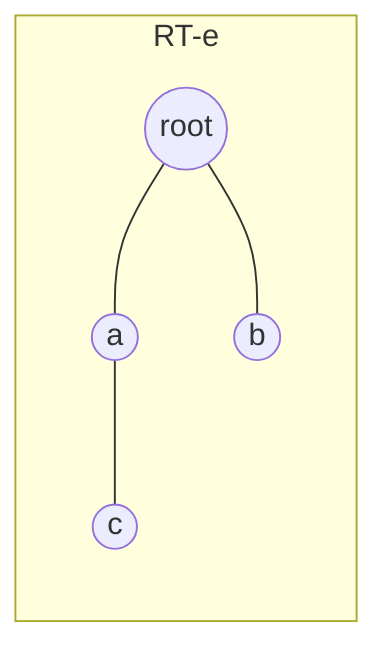
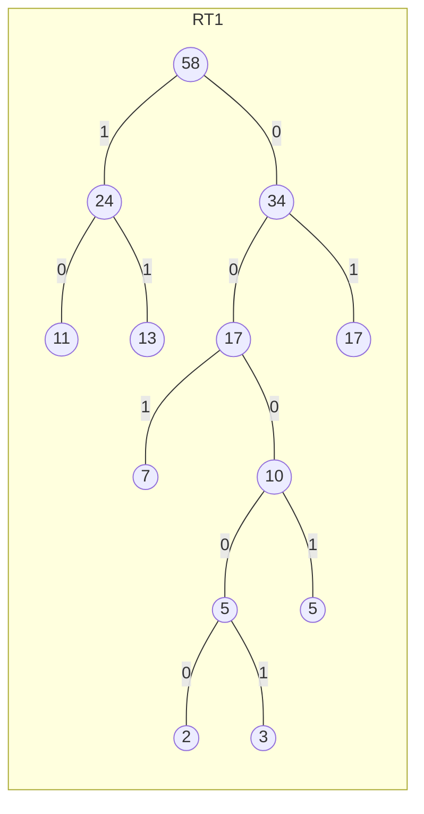

---
title: "离散数学笔记-图论"
author: Deed9189
tags:
- "笔记"
- "离散数学"
excerpt: "略"
date: 2026-06-15
hasAI: yes
---

> [!disclaimer]
> some parts were auto-completed by copilot, since I am a worn-out lazy heck, and never appeared to manage time properly.

## Summary

* 图的基本概念
  1. 图
  2. 通路与回路
  3. 图的连通性
  4. 图的矩阵表示
* 欧拉图与哈密顿图
  1. 欧拉图
  2. 哈密顿图
  3. 最短路问题
* 树
  1. 无向树及其性质
  2. 最小生成树
  3. 根树及其运用
* 平面图

---

## 一. 图的基本概念

1) 图

* 图是由顶点和边组成的数学结构，用于表示对象之间的关系。图可以是有向的或无向的，边可以带权重或不带权重。  

* 对于有向图或无向图，均用二元组 $\langle V, E \rangle$ 表示，其中 $V$ 为顶点集合，$E$ 为边集合。  

* 其中，对于边，无向边使用 $(v_1, v_2)$ 表示，其中 $v_1$ 与 $v_2$ 为两个端点，顺序可调换；  
有向边使用笛卡尔积 $V \times V$ 表示，即 $\langle v_1, v_2 \rangle$，其中 $v_1$ 与 $v_2$ 表示从 $v_1$ 指向 $v_2$ 的矢量，顺序不可调换。

* 图的**阶**，指图中**顶点**的个数。$n$ 个顶点的图即称作 $n$ 阶图。  
（零图：没有边的图；平凡图：1阶零图）

* 无向图的关联和相邻：
如图G1所示。  
  * 关联：  
    对于边 $e_1 = (v_1, v_2)$，称 $v_1$、$v_2$ 与 $e_1$ 相关联，且由于 $v_1$ 与 $v_2$ 不相同，关联次数为1。  
    假设一自反关系 $e_2 = (v_1, v_1)$ 定义在图G1上，则称 $e_2$ 与 $v_1$ 相关联，且关联次数为2。同理，$e_2$ 与 $v_2$ 的关联次数为0，即不关联。
  * 相邻：  
    对于任意有公共边的点，如 $v_1$、$v_2$ 或 $v_3$、$v_4$，称它们相邻。  
    对于任意有公共端点的边，如 $e_1$、$e_3$ 或 $e_4$、$e_5$，称它们相邻。

* 有向图的端点、关联和相邻：
如图D1所示。
  * 端点：
    对于有向边 $e_1 = \langle v_1, v_2 \rangle$，称 $v_1$ 为始点，$v_2$ 为终点。
  * 关联和相邻原理与无向图同理。

* 无向图的度数（度）：顶点 $v$ 作为无向边的端点的次数，记作 $d(v)$。  
  * 如图G1，$d(v_2) = 2$, $d(v_1) = 5$
* 有向图的度数：
  * 入度：顶点 $v$ 作为有向边的终点的次数，记作 $d^-(v)$
  * 出度：顶点 $v$ 作为有向边的始点的次数，记作 $d^+(v)$  
（$d(v) = d^+(v) + d^-(v)$）
  * 如图D2，  
  $
  \begin{aligned}
  \because \quad &d^+(v_2) = 1 \\
   &d^-(v_2) = 2 \\
  \therefore \quad &d(v_2) = d^+(v_2) + d^-(v_2) = 3 \\
  \\
  \because \quad &d^+(v_4) = 2 \\
   &d^-(v_4) = 2 \\
  \therefore \quad &d(v_4) = d^+(v_4) + d^-(v_4) = 4
  \end{aligned}
  $

* **握手定理**：
  * 无向图： $\sum_{v \in V} d(v) = 2|E|$  
  * 有向图：
    * $\sum_{v \in V} d(v) = 2|E|$
    * $\sum_{v \in V} d^-(v) = \sum_{v \in V} d^+(v) = |E|$
  * 推论:  
    * 任何图中，奇度顶点的个数是偶数  
    （原因：每条边都会贡献两次度数，因此所有度数的和必为偶数，所以奇度顶点的个数必须是偶数，否则矛盾）  
    * $\sum_{v \in V} d(v_{odd}) $ + $\sum_{v \in V} d(v_{even}) $ =  $\sum_{v \in V} d(v)$
  * e.g  
  已知$n$阶无向图$G$中有$m$条边，各个顶点的度数均为$3$，又已知$2n - 3 = m$, 则$m = \boxed{9}$  
  解析：  
  $
  \begin{aligned}
  \because \quad &3n = 2m \\
  &2n - 3 = m \\
  \therefore \quad &4n - 6 = 2m \\
  &m = \boxed{9}
  \end{aligned}
  $

* 度数列：  
  * $n$阶无向图：  
  $d(v_1), d(v_2), \ldots,d(v_n) \quad d = (d_1, d_2, \ldots, d_n)$
  * $n$阶有向图：
    * 入度列：  
    $d^-(v_1), d^-(v_2), \ldots, d^-(v_n) \quad d^- = (d_1^-, d_2^-, \ldots, d_n^-)$
    * 出度列：  
    $d^+(v_1), d^+(v_2), \ldots, d^+(v_n) \quad d^+ = (d_1^+, d_2^+, \ldots, d_n^+)$
  * e.g.  
    * 一个三阶有向图的度序列是$2, 2, 4$， 入度序列是$2, 0, 2$，则出度序列是$\boxed{0, 2, 2}$
  * 非负整数列$d = (d_1, d_2, \ldots d_n)$是可图化的，当且仅当$\sum^n_{i = 1} d_i$为偶数；
  * 非负整数列$d = (d_1, d_2, \ldots d_n)$是**简单可图化**的，当且仅当：
    * 1.$\sum^n_{i = 1}d_i$为偶数
    * 2.$d(v_i) \le n - 1$  
    即$\Delta(G) \le n - 1$  
    （注：最大度$\Delta(G)$，最小度$\delta(G)$）
  
* 无向完全图：设$G$为$n$阶无向简单图，若$G$中每个顶点均与其余的$n - 1$个顶点相邻，则称$G$为无向完全图，记作$K_n$。  
$n$阶无向完全图$K_n(n \ge 1)$的边的条数为$\frac{n(n - 1)}{2}$

---

2) 通路与回路

* 通路：对于无向图中G中的顶点与边的交替序列$\it{\Gamma} = v_{i_0}e_{j_1}v_{i_1}e_{j_2}v_{i_2} \ldots e_{j_k}v_{i_k}$，若$v_{i_0} = v_{j_k}$，则称$\it{\Gamma}$为回路。  
对于图$G1$，$\it{\Gamma_1} = v_1e_2v_3e_4$是一个回路。  

---

3) 图的连通性

* 设无向图$G = \langle V, E \rangle$，若$u, v \in V$之间存在通路，则称$u, v$是**连通**的，记作$u \sim v$  
若无向图$G$是平凡图或$G$中任意两个顶点都是连通的，则称$G$是连通图。

* 在有向图$G = \langle V, E \rangle$中，对于$u, v \in V$，若从$u$到$v$存在通路，则称$u$到$v$**可达**，记作$u \to v$。若在此基础上，从$v$到$u$也存在通路，则称$u，v$是相互可达的。规定$\forall u \in V, u \to u$。

* 对于有向图$G = \langle V, E \rangle$：  
  * 强连通图：$\forall u, v \in V, u \to v \land v \to u$
  * 单向连通图: $\forall u, v \in V, u \to v \lor v \to u$
  * 弱连通图: 在略去有向边后得到的无向图是连通的。
  
---

4) 图的矩阵表示

* 对于无向图$G = \langle V, E \rangle, V = \{v_1,v_2, \ldots, v_n\}, E = \{e_1, e_2, \ldots, e_m\}$, 令$m_{ij}$为$v_i$和$v_j$之间的边的条数，则称矩阵$M = [m_{ij}]_{n \times n}$为图$G$的关联矩阵。  

> \<aigc>

* 其他常用的图的矩阵表示：
  * 邻接矩阵(Adjacency matrix)：对于简单无向图$G$，定义$A=[a_{ij}]_{n\times n}$，其中
    a_{ij}=\begin{cases}1,&\text{若 }(v_i,v_j)\in E\\0,&\text{否则}\end{cases}
    对于有向图，$A$为非对称矩阵；对于带权图，$a_{ij}$可取为对应边的权值。

  * 关联矩阵(Incidence matrix)：对于无向图$G$，令$B=[b_{i j}]_{n\times m}$，顶点为行、边为列，若边$e_j$与顶点$v_i$关联则$b_{ij}=1$（环可计为2），否则为0。对于有向图可将入、出端用-1、+1标记。

  * 度矩阵(Degree matrix)：对角矩阵$D=\operatorname{diag}(d(v_1),\ldots,d(v_n))$，常与邻接矩阵一起用于构造拉普拉斯矩阵。

  * 拉普拉斯矩阵(Graph Laplacian)：定义为$L=D-A$，其中$D$为度矩阵，$A$为邻接矩阵。$L$为对称半正定矩阵，零特征值的重数等于连通分支数，可用于研究图的谱性质、连通性与随机游走。

  * 归一化拉普拉斯矩阵(Normalized Laplacian)：一种常用形式为$\mathcal{L}=D^{-1/2}LD^{-1/2}=I-D^{-1/2}AD^{-1/2}$，便于处理度异质性的图谱分析。

 这些矩阵在图论的算法与谱图理论中广泛使用，用于表示结构、计算最短路、连通分量、谱聚类等。

> \</aigc>

---

## 二. 欧拉图与 ~~汉密尔顿~~ 哈密顿图

1) 欧拉图

* 欧拉通路：通过图中所有**边**一次，且**仅通过一次**的通路。
* 欧拉回路：定义相同的回路
* **欧拉图**：具有欧拉回路的图
* **半欧拉图**：具有欧拉通路但不具有欧拉回路的图
  * 无向图$G$是欧拉图，当且仅当$G$是连通图且$\forall v \in V, d(v)$为偶数
  * 有向图$D$是欧拉图，当且仅当D为强连通图，且$\forall v \in V, d^+(v) = d^-(v)$

---

2) 哈密顿图

* 哈密顿通路：经过图中所有**顶点**一次，且**仅经过一次**的通路。
* 哈密顿回路：定义相同的回路
* 哈密顿图：具有哈密顿回路的图
* 半哈密顿图：具有哈密顿通路但不具有哈密顿回路的图
  * **充分**条件：
    * 设$G$是$n$阶无向简单图，若$\forall u, v \in V, \neg(u \sim v) \land d(u) + d(v) \ge n - 1$, 则G中存在哈密顿通路
    * 设$G$是$n(n \ge 3)$阶简单无向图，若$\forall u, v \in V, \neg(u \sim v) \land d(u) + d(v) \ge n$，则$G$中存在哈密顿回路

---

3) **最短路问题**

* 权和带权图：

* 称图$G = \langle V, E, W \rangle$为带权图，其中$W$为权集，$W = \{w_1, w_2, \ldots, w_m\}$，$w_i$为边$e_i$的权值。

* 最短路径：在带权图中，$\forall u, v \in V$，$u \sim v$时，从$u$到$v$长度$($权的和$)$最短的路径，称其长度为从$u$到$v$的距离，记作$d(u, v)$。  
规定：
  * $d(u, u) = 0$
  * $ \neg(u \sim v) \Rightarrow d(u, v) = +\infty$

* 最短路问题：在带权图中，求$\forall u, v \in V$，$u \sim v$时，从$u$到$v$的最短路径。

* 计算方法：**Dijkstra算法**
  * 算法思想：  
    * 初始化：设定起点$s$，将$s$加入已确定最短路径的集合$S$，并将所有顶点的距离$d(v)$初始化为$\infty$，除了$d(s) = 0$。
    * 迭代：
        1. 从未确定的顶点中选择距离最小的顶点$u$，将其加入集合$S$。  
        （第一次选择也就是加入$s$）
        2. 对于每个与$u$相邻的顶点$v \notin S$，检查是否可以通过$u$更新$d(v)$：
        $$
          d(v) = \min(d(v), d(u) + w(u, v))
        $$
    * 重复迭代步骤，直到所有顶点都被加入集合$S$或所有可达顶点的最短路径已确定。

    （其实我也不知道怎么描述，以上是aigc）

---

## 三. 树
> ——*THEY ARE IN THE GOD DAMN TREES*

1) 无向树及其性质

* 无向树：连通且无回路的无向图$G = \langle V, E \rangle$
* 树叶：$d(v) = 1, v \in V$
* 分支点：$d(v) \ge 2, v \in V$
* 对于$n$阶$m$条边的无向树$G = \langle V, E \rangle$，下列各命题等价：
  * $G$是树
  * $G$中任意两个顶点之间存在唯一路径
  * $G$无回路且$m = n - 1$
  * $G$是连通的且$m = n - 1$
* 若$T$是$n(n \ge 2)$阶无向树，则$T$中至少有两片树叶 

---

2) 最小生成树

* 子图： 设$G = \langle V, E \rangle$，若$G' = \langle V', E' \rangle$满足$V' \subseteq V, E' \subseteq E$，则称$G'$为$G$的子图。  
若$V' = V$，则称$G'$为$G$的生成子图。

* 生成树：设$G = \langle V, E \rangle$为连通图，若$T = \langle V, E' \rangle$是$G$的生成子图，且$T$是树，则称$T$为$G$的生成树。  
**无向图G有生成树当且仅当G是连通图**

* 生成树的权： 设$T = \langle V, E' \rangle$是$G$的生成树，且$G$是带权图，边$e \in E'$的权为$W(e)$，则$T$的权定义为$W(T) = \sum_{e \in E'} W(e)$。

* 最小生成树：G的所有生成树中，权最小的生成树  

* **求最小生成树的算法：**
  1. 给权排序
  2. 描点，将边数置0
  3. 一直选择权最小且不构成回路的边，直到$|E| = |V| - 1$结束

---

3) 根数及其运用

* 有向树：若有向图的基图是无向树，则称该有向图为有向树
* 根树：一个顶点的$d^+(v) = 0$，其余顶点的$d^+(v) = 1$的有向树。  
称$d^+(v) = 0$的点为树根。
* 层数：从树根到顶点的路径长度。(路径中的边数)

> 在画根树时，树根位于顶部，层数从树根向下递增，一般省略箭头。

* 若$T$的每个分支点至多有$r$个儿子，则称$T$为$r$叉树。  

* ~~Ceddin deden, neslin baban~~  
祖先，后代，父亲，儿子，兄弟：字面意思

* 最优二叉树：权最小的二叉树  
求树的权：

$$
W(T) = \sum_{i=1}^{t} W_i \cdot l(V_i)
$$

* **求最优二叉树的算法**($Huffman$算法)：
  1. 给权排序
  2. 选择权最小的两个点，合并为一个新点，新点的权为两个点的权之和
  3. 重复步骤1, 2, 直到只剩一个顶点

* 根数的运用：
  * 二元前缀码：0-1符号串构成的前缀码
  * 最佳前缀码：由最优二叉树产生的前缀码  
  求最佳前缀码的算法：
    1. 将各个节点按照权值从小到大排列，构造最优二叉树
    2. 将各个节点的边按照分支数量标记。对于二元前缀码，左边标记为0，右边标记为1。
    (mermaid不便表示此标记法)
    3. 从树根到各个叶子节点的路径即为最佳前缀码，如图$RT1$所示，$58 \to 34 \to 17 \to 7$的最佳前缀码为$011$，$58 \to 24 \to 13$的最佳前缀码为$11$，以此类推。  
    （解题：前缀码的集合中**任何一个字符串都不是其他字符串的前缀**）

* e.g.  
在通信中，设八进制数字出现的概率(%)为（）

---

得，写不完了，让我拖完了，只能说f1太好看了。
