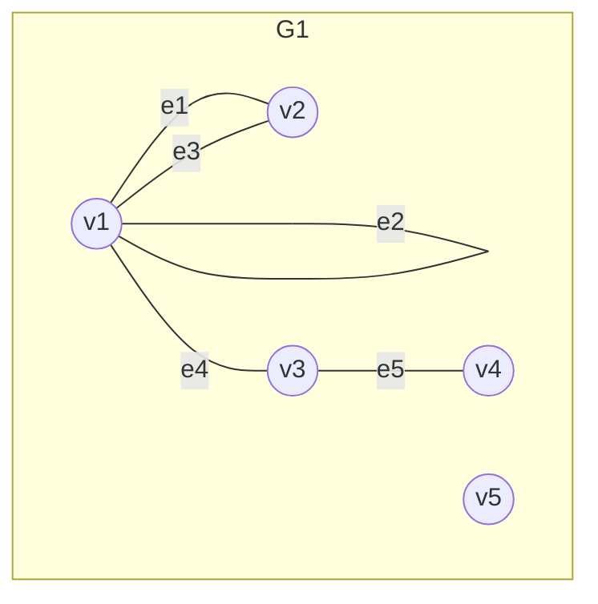
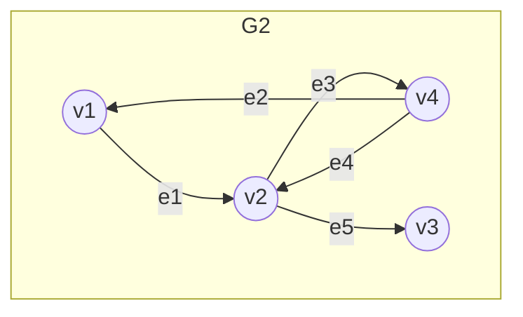

---
title: "离散数学笔记-图论"
author: Deed9189
tags:
- "笔记"
- "离散数学"
excerpt: "略"
date: 2026-06-15
hasAI: false
---

## Summary

* 图的基本概念
    1. 图
    2. 通路与回路
    3. 图的连通性
    4. 图的矩阵表示
* 欧拉图与汉密尔顿图
* 树
* 平面图

---

## 一. 图的基本概念

* 图是由顶点和边组成的数学结构，用于表示对象之间的关系。图可以是有向的或无向的，边可以带权重或不带权重。  

* 对于有向图或无向图，均用二元组 $\langle V, E \rangle$ 表示，其中 $V$ 为顶点集合，$E$ 为边集合。  

* 其中，对于边，无向边使用 $(v_1, v_2)$ 表示，其中 $v_1$ 与 $v_2$ 为两个端点，顺序可调换；  
有向边使用笛卡尔积 $V \times V$ 表示，即 $\langle v_1, v_2 \rangle$，其中 $v_1$ 与 $v_2$ 表示从 $v_1$ 指向 $v_2$ 的矢量，顺序不可调换。

* 图的**阶**，指图中**顶点**的个数。$n$ 个顶点的图即称作 $n$ 阶图。  
（零图：没有边的图；平凡图：1阶零图）

* 无向图的关联和相邻：
如图G1所示。  
  * 关联：  
    对于边 $e_1 = (v_1, v_2)$，称 $v_1$、$v_2$ 与 $e_1$ 相关联，且由于 $v_1$ 与 $v_2$ 不相同，关联次数为1。  
    假设一自反关系 $e_2 = (v_1, v_1)$ 定义在图G1上，则称 $e_2$ 与 $v_1$ 相关联，且关联次数为2。同理，$e_2$ 与 $v_2$ 的关联次数为0，即不关联。
  * 相邻：  
    对于任意有公共边的点，如 $v_1$、$v_2$ 或 $v_3$、$v_4$，称它们相邻。  
    对于任意有公共端点的边，如 $e_1$、$e_3$ 或 $e_4$、$e_5$，称它们相邻。

* 有向图的端点、关联和相邻：
如图G2所示。
  * 端点：
    对于有向边 $e_1 = \langle v_1, v_2 \rangle$，称 $v_1$ 为始点，$v_2$ 为终点。
  * 关联和相邻原理与无向图同理。

* 无向图的度数（度）：顶点 $v$ 作为无向边的端点的次数，记作 $d(v)$。  
  * 如图G1，$d(v_2) = 2$, $d(v_1) = 5$
* 有向图的度数：
  * 入度：顶点 $v$ 作为有向边的终点的次数，记作 $d^-(v)$
  * 出度：顶点 $v$ 作为有向边的始点的次数，记作 $d^+(v)$  
（$d(v) = d^+(v) + d^-(v)$）
  * 如图G3，  
  $
  \begin{aligned}
  \because \quad &d^+(v_2) = 1 \\
   &d^-(v_2) = 2 \\
  \therefore \quad &d(v_2) = d^+(v_2) + d^-(v_2) = 3 \\
  \\
  \because \quad &d^+(v_4) = 2 \\
   &d^-(v_4) = 2 \\
  \therefore \quad &d(v_4) = d^+(v_4) + d^-(v_4) = 4
  \end{aligned}
  $

* **握手定理**：
  * 无向图： $\sum_{v \in V} d(v) = 2|E|$  
  * 有向图：
    * $\sum_{v \in V} d(v) = 2|E|$
    * $\sum_{v \in V} d^-(v) = \sum_{v \in V} d^+(v) = |E|$
  * 推论:  
    * 任何图中，奇度顶点的个数是偶数  
    （原因：每条边都会贡献两次度数，因此所有度数的和必为偶数，所以奇度顶点的个数必须是偶数，否则矛盾）  
    * $\sum_{v \in V} d(v_{odd}) $ + $\sum_{v \in V} d(v_{even}) $ =  $\sum_{v \in V} d(v)$
  * e.g  
  已知$n$阶无向图$G$中有$m$条边，各个顶点的度数均为$3$，又已知$2n - 3 = m$, 则$m = \boxed{9}$  
  解析：  
  $
  \begin{aligned}
  \because \quad &3n = 2m \\
  &2n - 3 = m \\
  \therefore \quad &4n - 6 = 2m \\
  &m = \boxed{9}
  \end{aligned}
  $

* 度数列：  
  * $n$阶无向图：  
  $d(v_1), d(v_2), \ldots,d(v_n) \quad d = (d_1, d_2, \ldots, d_n)$
  * $n$阶有向图：
    * 入度列：  
    $d^-(v_1), d^-(v_2), \ldots, d^-(v_n) \quad d^- = (d_1^-, d_2^-, \ldots, d_n^-)$
    * 出度列：  
    $d^+(v_1), d^+(v_2), \ldots, d^+(v_n) \quad d^+ = (d_1^+, d_2^+, \ldots, d_n^+)$
  * e.g.  
    * 一个三阶有向图的度序列是$2, 2, 4$， 入度序列是$2, 0, 2$，则出度序列是$\boxed{0, 2, 2}$